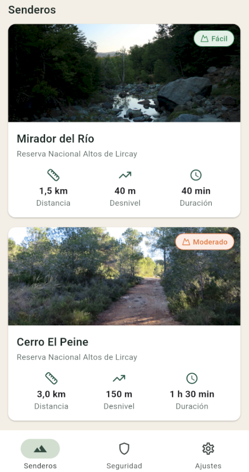
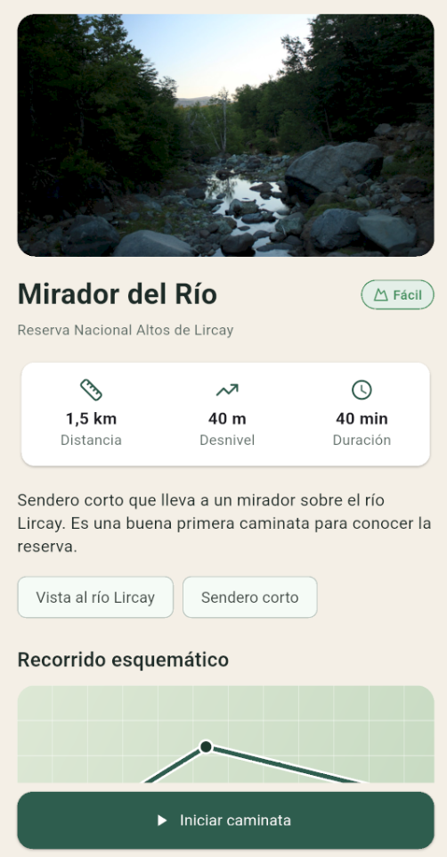
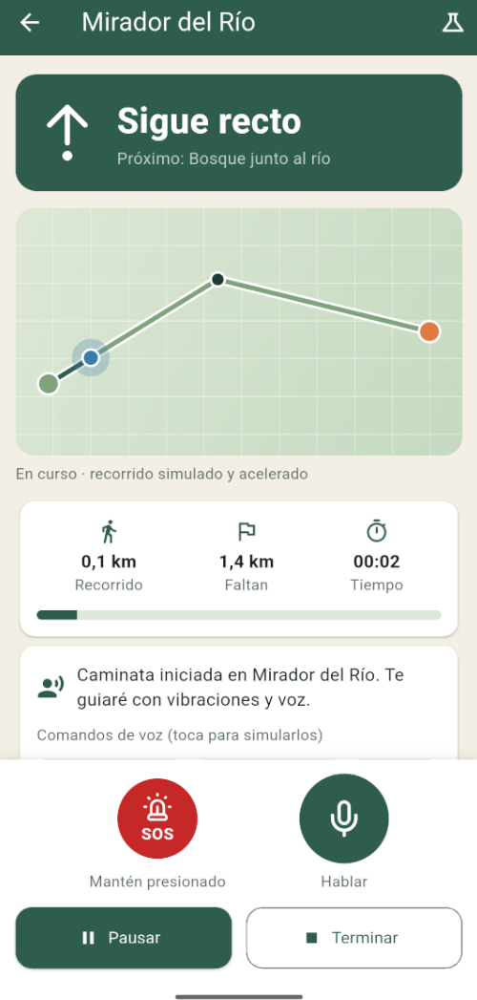
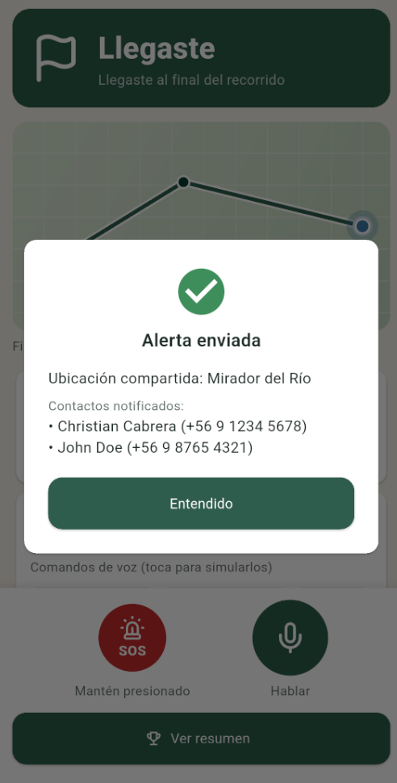
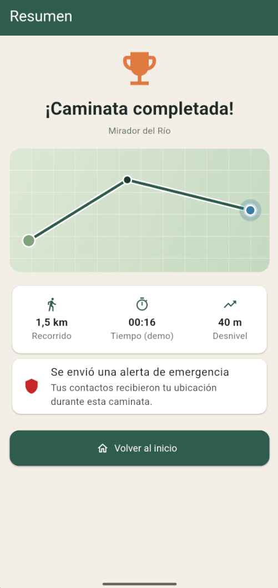
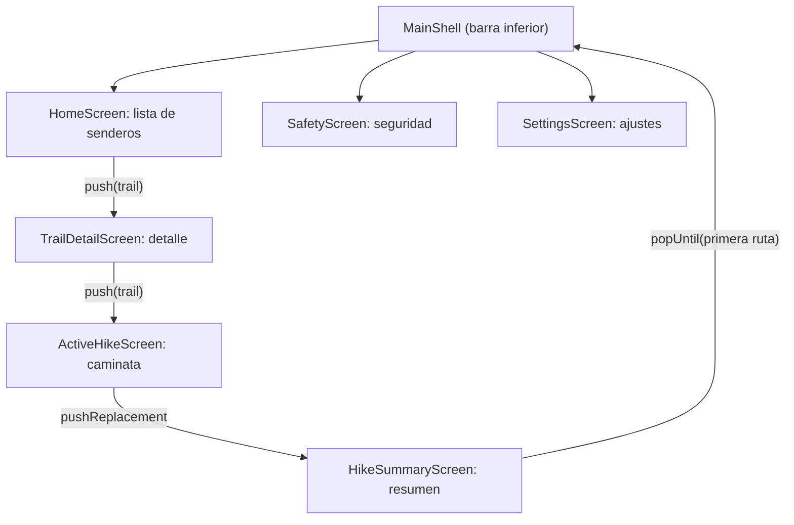

# Lircay Trail

> Maqueta funcional para **LircayHub** · Producto de Software 1 · Programación de Dispositivos Móviles 2026-02 · Universidad de Talca

Lircay Trail es una app de senderismo pensada para la Reserva Nacional Altos de Lircay (Región del Maule). Te acompaña mientras caminas: te avisa por **vibración** y por **voz** cuándo doblar, la puedes controlar hablándole, te manda avisos importantes y tiene un botón **SOS** para pedir ayuda. Todo está pensado para funcionar **sin conexión**, porque en la montaña no se puede contar con señal.

Esto es una maqueta, no la app terminada. Me concentré en el flujo principal: **elegir un sendero → ver su detalle → salir a caminar con la guía activa**.

## Capturas

| Lista de senderos | Detalle del sendero | Caminata activa |
|---|---|---|
|  |  |  |

| SOS enviado | Aviso de caída | Resumen |
|---|---|---|
|  |  |  |

## Índice

1. [Definición del producto y paradigma](#1-definición-del-producto-y-paradigma)
2. [Especificación de requerimientos](#2-especificación-de-requerimientos)
3. [Arquitectura y jerarquía de navegación](#3-arquitectura-y-jerarquía-de-navegación)
4. [Despliegue y material de apoyo](#4-despliegue-y-material-de-apoyo)
5. [Pendientes y limitaciones conocidas](#5-pendientes-y-limitaciones-conocidas)

---

## 1. Definición del producto y paradigma

### El problema

Altos de Lircay es la mayor área protegida de la región, con unas 16.700 hectáreas, y recibe visitantes todo el año. Las caminatas son largas: el Mirador del Venado ronda los 11,7 km y el Enladrillado unos 12 km. En ese terreno se juntan tres cosas que complican todo. Primero, no se puede asumir que haya señal. Segundo, uno camina con bastones, guantes o mochila y casi nunca tiene una mano libre para el celular, así que mirar la pantalla a cada rato es incómodo y hasta riesgoso. Tercero, si algo sale mal (una torcedura, una caída, perderse en una bifurcación) la ayuda queda lejos. Las apps de mapas normales exigen mirar la pantalla todo el tiempo, dependen de internet y no están pensadas para avisarle a alguien si te pasa algo.

### La solución

Lircay Trail resuelve eso con una guía que se **siente y se escucha** en vez de solo verse. Cada indicación (seguir recto, girar a la izquierda, girar a la derecha, te saliste del sendero, llegaste) tiene su propio patrón de vibración y su propia frase hablada, así que puedes ir con el teléfono en el bolsillo y saber qué hacer. Además puedes pedirle cosas por voz ("¿cuánto falta?", "pausa", "auxilio"), recibes avisos de clima o de hora límite de regreso, y si necesitas ayuda mantienes presionado el botón SOS para avisar a tus contactos con tu ubicación. Si la app detecta una posible caída te pregunta si estás bien y, si no respondes en 10 segundos, envía la alerta sola.

### Por qué tiene que ser una app móvil

Un computador no sube al cerro. El problema ocurre en terreno, de pie, caminando, y justamente ahí es donde el teléfono aporta lo que un software de escritorio no puede: va en el bolsillo, tiene motor de vibración, micrófono, parlante, sensores y notificaciones. Si le quitas esas capacidades, la idea completa pierde sentido, porque lo que la hace útil es poder guiarte sin que mires la pantalla.

| Capacidad del celular | Para qué la uso | Estado en la maqueta |
|---|---|---|
| Vibración | Indicaciones de giro que se sienten sin mirar | Real |
| Parlante (texto a voz) | Frases como "gira a la izquierda en la bifurcación" | Real |
| Micrófono (voz a texto) | Comandos manos libres | Real |
| Notificaciones | Avisos de clima, camping y hora límite | Simulado dentro de la app |
| Acelerómetro | Detectar una caída | Simulado desde el menú de demo |
| GPS | Compartir la ubicación en el SOS y moverse por el mapa | Simulado |

### Por qué Flutter

Elegí Flutter porque con un solo código puedo apuntar a Android e iOS, porque el hot reload acelera mucho el ciclo de probar y corregir, y porque todo es un widget: eso calza justo con lo que pide, que es componer jerarquías de widgets reutilizables (por ejemplo, `TrailCard` y `StatTile` se usan en más de una pantalla). Además existen plugins maduros para lo que necesito (`vibration`, `flutter_tts`, `speech_to_text`), así que la parte de hardware no me obligó a escribir código nativo.

| Alternativa | Por qué no la elegí |
|---|---|
| Nativo (Kotlin + Swift) | Habría que hacer y mantener dos apps; demasiado para una maqueta |
| React Native | Es válido, pero no lo domino tanto y el curso se enfoca en Flutter |
| Web / PWA | El acceso a vibración y sensores es limitado según el navegador, y el trabajo sin conexión es más frágil |

### Cómo encaja con "Workspace Mobile Firsts"

Aquí el flujo crítico es la **seguridad en terreno**, que por definición no ocurre frente a un computador. La misma lógica se podría extender a guías y operadores turísticos que cuidan grupos, pero la maqueta se queda en el caso de una persona caminando.

### Qué es real y qué es simulado

Para una maqueta es importante ser claro con esto. Lo que depende del hardware del teléfono es real: la vibración, la voz que habla y el reconocimiento de comandos. Lo que dependería de infraestructura (GPS, envío de alertas, mapas, clima) lo simulo asumiendo el mejor escenario: mapas siempre disponibles, GPS exacto, alertas que siempre se entregan. El recorrido de la caminata es una demo acelerada: cada tramo dura 8 segundos reales y el menú de demo (ícono del matraz) permite provocar un desvío, una caída, un aviso de clima o la hora límite.

---

## 2. Especificación de requerimientos

### Historias de usuario

El rol principal es el **senderista**.

- **HU-01.** Como senderista, quiero ver una lista de senderos de Altos de Lircay con su foto, dificultad, distancia y desnivel, para elegir una ruta acorde a mi nivel.
- **HU-02.** Como senderista, quiero abrir el detalle de un sendero, para conocer su descripción, sus puntos y un esquema del trayecto antes de decidir.
- **HU-03.** Como senderista, quiero probar las indicaciones de vibración y voz antes de salir, para entender cómo me va a guiar la app.
- **HU-04.** Como senderista, quiero recibir las indicaciones de giro por vibración y por voz durante la caminata, para guiarme sin sacar el teléfono ni mirar la pantalla.
- **HU-05.** Como senderista, quiero activar un SOS manteniendo presionado un botón, para avisar a mis contactos con mi ubicación si tengo una emergencia.
- **HU-06.** Como senderista, quiero que la app detecte una posible caída y me pregunte si estoy bien, para que se pida ayuda aunque yo no pueda hacerlo.
- **HU-07.** Como senderista, quiero controlar la app con la voz ("cuánto falta", "pausa", "dónde estoy"), para usarla con guantes o con las manos ocupadas.
- **HU-08.** Como senderista, quiero recibir avisos de clima, camping y hora límite de regreso, para planificar mi vuelta con seguridad.
- **HU-09.** Como senderista, quiero ver un resumen al terminar la caminata, para revisar cuánto recorrí y si hubo alguna alerta.

### Matriz de requerimientos

**Requerimientos funcionales**

| ID | Requerimiento | Historia | Dónde se ve en el código |
|---|---|---|---|
| RF-01 | Listar senderos con foto, dificultad, distancia, desnivel y duración | HU-01 | `home_screen.dart`, `trail_card.dart` |
| RF-02 | Navegar de la lista al detalle del sendero seleccionado, pasando el objeto `Trail` | HU-02 | `home_screen.dart`, `trail_detail_screen.dart` |
| RF-03 | Mostrar en el detalle la descripción, los puntos del recorrido y un esquema del trayecto | HU-02 | `trail_detail_screen.dart`, `trail_map_preview.dart` |
| RF-04 | Probar cada indicación (vibración y voz) antes de salir | HU-03 | `trail_detail_screen.dart`, `haptic_service.dart`, `voice_service.dart` |
| RF-05 | Iniciar una caminata simulada que avanza punto a punto | HU-04 | `active_hike_view_model.dart` |
| RF-06 | Disparar en cada punto la indicación (texto, vibración y voz) | HU-04 | `nav_cue.dart`, `haptic_pattern.dart`, `nav_cue_banner.dart` |
| RF-07 | SOS por presión sostenida de 2 segundos, con confirmación de los contactos notificados | HU-05 | `sos_button.dart`, `active_hike_screen.dart` |
| RF-08 | Detección de caída (simulada) con cuenta regresiva de 10 segundos | HU-06 | `active_hike_view_model.dart`, `active_hike_screen.dart` |
| RF-09 | Comandos de voz: cuánto falta, dónde estoy, repite, pausa, continuar, terminar y auxilio | HU-07 | `voice_service.dart`, `active_hike_view_model.dart` |
| RF-10 | Mostrar avisos de clima, camping y hora límite, con vibración | HU-08 | `notification_service.dart`, `alert_tile.dart` |
| RF-11 | Pausar, reanudar y terminar la caminata, y mostrar un resumen | HU-09 | `hike_control_bar.dart`, `hike_summary_screen.dart` |
| RF-12 | Administrar contactos de emergencia y hora límite de regreso | HU-05, HU-08 | `safety_screen.dart`, `app_settings.dart` |
| RF-13 | Activar o desactivar vibración, voz y notificaciones | HU-03 | `settings_screen.dart`, `app_settings.dart` |

**Requerimientos no funcionales**

| ID | Requerimiento | Cómo se cumple |
|---|---|---|
| RNF-01 | Funcionar sin conexión | No hay red ni base de datos; todo sale de datos locales en `mock_data.dart` |
| RNF-02 | Arquitectura modular, con la interfaz separada de la lógica | Carpetas `core`, `models` y `ui`; la lógica de la caminata vive en un ViewModel |
| RNF-03 | Identidad visual centralizada | `ThemeData` global, `AppColors`, `AppTextStyles` y tipografía Nunito |
| RNF-04 | Lista eficiente | `SliverList.builder` y fotos con `cacheWidth` limitado |
| RNF-05 | Usable en terreno | Botones de 76 px y acciones críticas con presión sostenida para evitar toques accidentales |
| RNF-06 | Respaldo no visual | Cada indicación importante llega también por vibración y por voz |
| RNF-07 | Accesibilidad básica | Etiquetas semánticas en las fotos (`semanticLabel`) |
| RNF-08 | Mantenibilidad | Rutas de assets en `AppAssets` y datos de ejemplo en un solo archivo |
| RNF-09 | Plataforma | Pensada para Android; iOS no se ha probado |
| RNF-10 | Control de versiones | Git con `.gitignore` y commits pequeños por pieza |

---

## 3. Arquitectura y jerarquía de navegación

### Estructura de carpetas

```
lib/
├── main.dart                      # arranque, providers y tema
├── core/                          # lo que no es pantalla
│   ├── constants/
│   │   └── app_assets.dart        # rutas de imágenes e íconos
│   ├── data/
│   │   └── mock_data.dart         # senderos, contactos y avisos
│   ├── enums/                     # dificultad, indicación, vibración, estado, tipo de aviso
│   ├── services/                  # vibración, voz, avisos y ajustes
│   └── utils/
│       └── formatters.dart        # formato de km y tiempo
├── models/                        # clases de datos: Trail, Waypoint, HikeSession...
└── ui/                            # todo lo que se dibuja
    ├── screens/                   # una pantalla por archivo
    ├── theme/                     # colores, estilos de texto y ThemeData
    ├── viewmodels/
    │   └── active_hike_view_model.dart
    └── widgets/                   # piezas reutilizables

assets/
├── font/      # Nunito (variable)
├── icons/     # 14 íconos SVG
└── images/    # 7 fotos
```

Separé el código en tres capas simples. En `core` va lo que no es una pantalla (enums, servicios, datos y constantes), en `models` van las clases que representan la información (un `Trail`, un `Waypoint`, una `HikeSession`) y en `ui` va todo lo que se dibuja. La regla que me puse es que nada de `core` ni de `models` importa algo de `ui`: por ejemplo, los enums no saben nada de Material, y los íconos y colores de cada enum viven aparte en `ui/theme/enum_visuals.dart`. Así puedo cambiar el diseño sin tocar la lógica y viceversa. Como alternativa existía organizar por funcionalidad (una carpeta por feature), pero eso conviene más cuando la app tiene muchos módulos; para una maqueta con un flujo principal, las capas son más fáciles de leer y de explicar.

### Manejo de estado: provider y MVVM

Usé `provider` con el patrón MVVM. Los servicios (`HapticService`, `VoiceService`, `NotificationService`, `AppSettings`) se crean una sola vez en `main.dart` y se inyectan con `MultiProvider`. La pantalla de caminata activa tiene su propio `ActiveHikeViewModel`, que concentra el cronómetro, el avance por los puntos, el SOS, la caída y los comandos de voz, mientras que la pantalla solo dibuja lo que el ViewModel le dice. Lo elegí en vez de dejar todo con `setState` porque la caminata tiene varios timers y estados que se cruzan (pausa, caída, SOS, escuchando), y mezclar eso con los widgets hubiera sido un desorden. Soluciones como Bloc o Riverpod también servían, pero agregan bastante estructura para el tamaño de esta maqueta.

```dart
// active_hike_screen.dart: el ViewModel nace con el sendero elegido
ChangeNotifierProvider(
  create: (ctx) => ActiveHikeViewModel(
    trail: trail,
    haptic: ctx.read<HapticService>(),
    voice: ctx.read<VoiceService>(),
    notifications: ctx.read<NotificationService>(),
    settings: ctx.read<AppSettings>(),
  ),
  child: const _ActiveHikeView(),
);
```

### Identidad visual centralizada

Los colores están en `AppColors`, los estilos de texto en `AppTextStyles` y todo se conecta en un `ThemeData` global (`app_theme.dart`) con la fuente Nunito. Las rutas de las imágenes y de los íconos están todas en `AppAssets`, de modo que ningún widget escribe un nombre de archivo a mano; si renombro una foto, cambio una sola línea. Nunito viene como fuente variable, así que cada peso (semibold, bold, extrabold) se fija con el eje `wght`, y el tema lo aplica a todos sus estilos.

```dart
// app_assets.dart
static const String imgEnladrillado = '$_img/enladrillado.jpg';
static const String icSos = '$_ico/ic_sos.svg';

// app_text_styles.dart
static const TextStyle title = TextStyle(
  fontSize: 18,
  fontWeight: FontWeight.w600,
  fontVariations: [FontVariation('wght', 600)],
  color: AppColors.ink,
);
```

Los íconos SVG se dibujan con un widget propio, `AppIcon`, que los tiñe con el color del tema; así un mismo archivo sirve en distintos colores.

### Datos

Todo sale de `core/data/mock_data.dart`. Los seis senderos son reales de la reserva, pero no todas las cifras están verificadas todavía, y prefiero decirlo de frente:

| Sendero | Estado de las cifras |
|---|---|
| Mirador del Venado | Verificado en Andeshandbook: 11,7 km, 686 m de desnivel, fácil, 4 a 5 horas de ida |
| El Enladrillado | Distancia (12 km) y dificultad (moderada) verificadas; desnivel y tiempo provisorios |
| Mirador del Río | Provisorio |
| Cerro El Peine | Provisorio |
| Valle del Venado | Provisorio |
| Laguna El Alto | Provisorio |

Las coordenadas de los puntos son esquemáticas: sirven para dibujar el trayecto ilustrativo y no son un track GPS real, y la pantalla de detalle lo avisa. Los avisos de ejemplo usan datos reales de las fuentes, como que el portón de Vilches Alto se cierra con candado a las 17:30 o que fuera de verano solo está habilitado el camping Antahuara.

### Jerarquía de navegación



La navegación es una pila con el `Navigator` de Flutter, y el flujo principal va así:

1. `MainShell` muestra `HomeScreen` con la lista de senderos. La barra inferior da acceso a Seguridad y Ajustes, que son pantallas de apoyo y no parte del flujo principal.
2. Al tocar una tarjeta se hace `push` a `TrailDetailScreen`, pasándole el `Trail` elegido.
3. Desde el detalle, "Iniciar caminata" hace `push` a `ActiveHikeScreen`, que crea su ViewModel con ese mismo `Trail`.
4. Al terminar se usa `pushReplacement` hacia `HikeSummaryScreen`: la caminata sale de la pila, su ViewModel se destruye y con él se cancelan los timers, la voz y la vibración, así no queda nada corriendo en segundo plano.
5. "Volver al inicio" hace `popUntil` a la primera ruta y deja la pila limpia.

Para el paso de datos usé el camino más directo: el constructor. La lista le pasa el objeto completo al detalle y el detalle lo usa tal cual, sin buscarlo de nuevo. Eso garantiza que lo que se muestra corresponde exactamente a lo que se tocó. Las fotos además usan una animación `Hero` con la etiqueta `trail-image-<id>`, que conecta visualmente la tarjeta con el detalle.

```dart
// home_screen.dart: la lista pasa el objeto elegido
onTap: () => Navigator.of(context).push(
  MaterialPageRoute(builder: (_) => TrailDetailScreen(trail: trail)),
),

// trail_detail_screen.dart: el detalle lo recibe por constructor
class TrailDetailScreen extends StatelessWidget {
  const TrailDetailScreen({super.key, required this.trail});
  final Trail trail;
  // ...
}
```

Usé `Navigator.push` imperativo en vez de rutas con nombre o un paquete como `go_router` porque la jerarquía es corta (cuatro niveles) y quería que cada transición se pudiera leer directamente en el widget que la dispara. Con más pantallas o enlaces profundos, `go_router` sería el siguiente paso.

---

## 4. Despliegue y material de apoyo

### Requisitos

- Flutter instalado, con Dart `^3.13` (así lo declara el `pubspec.yaml`).
- Android Studio o VS Code con las extensiones de Flutter y Dart.
- Un **teléfono Android real**, de preferencia: el emulador no vibra y el micrófono suele dar problemas.

### Pasos para correrlo

```bash
git clone <URL_DEL_REPOSITORIO>
cd lircayhub
flutter pub get
flutter analyze
flutter run
```

En `android/app/src/main/AndroidManifest.xml` hacen falta los permisos de vibración y micrófono, y la consulta de los servicios de voz (Android 11 o superior):

```xml
<uses-permission android:name="android.permission.VIBRATE"/>
<uses-permission android:name="android.permission.RECORD_AUDIO"/>
<queries>
  <intent><action android:name="android.intent.action.TTS_SERVICE"/></intent>
  <intent><action android:name="android.speech.RecognitionService"/></intent>
</queries>
```

Para generar el APK: `flutter build apk --release`. En esa versión conviene agregar también `<uses-permission android:name="android.permission.INTERNET"/>`, porque el reconocimiento de voz de muchos teléfonos lo necesita.

### Si algo falla

| Síntoma | Qué revisar |
|---|---|
| `Unable to load asset` | Que las carpetas estén en `pubspec.yaml` y que los nombres coincidan exactamente, mayúsculas incluidas; después reiniciar la app por completo (no basta el hot reload) |
| `flutter pub get` falla con "Duplicate mapping key" | Que `pubspec.yaml` no tenga una clave repetida, por ejemplo dos `uses-material-design` |
| Los íconos no compilan | Que `flutter_svg` esté en `dependencies` |
| No vibra | Probar en un teléfono físico |
| La voz no responde | Permiso de micrófono concedido y conexión a internet |

### Material de apoyo

- **Video de exposición técnica (5 min):** `hoy`
- **Repositorio:** `https://github.com/Condordie/Lircayhub`

### Créditos de recursos

| Recurso | Autor / licencia / enlace |
|---|---|
| Fotos (`assets/images/`, 7 archivos) | `[completar: autor, licencia y enlace de cada foto]` |
| Íconos (`assets/icons/`, 14 SVG) | `[confirmar origen y licencia]` (por ejemplo, Lucide con licencia ISC) |
| Tipografía Nunito | Google Fonts, licencia SIL Open Font License |
| Datos de senderos | Andeshandbook (Mirador del Venado y El Enladrillado) y CONAF (Reserva Nacional Altos de Lircay) |

---

## 5. Pendientes y limitaciones conocidas

- Cada `Navigator.push` está escrito en el widget donde se usa; falta centralizar las rutas en un solo archivo.
- Quedan algunos `Colors.white` y estilos de texto sueltos en widgets que conviene mover al tema.
- Las cifras provisorias de los senderos hay que verificarlas con CONAF o Andeshandbook.
- `ActiveHikeViewModel` (unas 370 líneas) y la pantalla de caminata activa son los archivos más largos y se podrían dividir.
- Notificaciones del sistema, acelerómetro y GPS reales quedaron fuera de la maqueta.
- El reconocimiento de voz suele necesitar internet, lo que choca con la idea de funcionar sin señal; los chips de comandos de la pantalla son el respaldo.
- Seguridad y Ajustes.